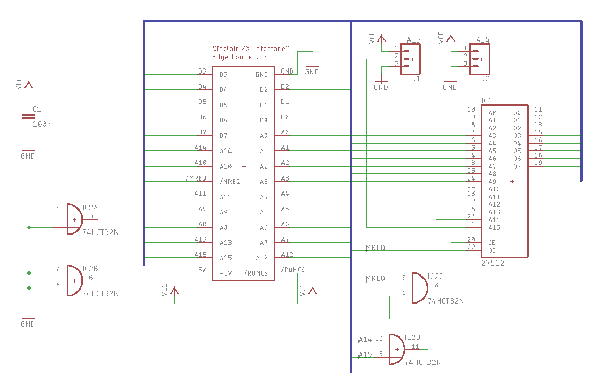
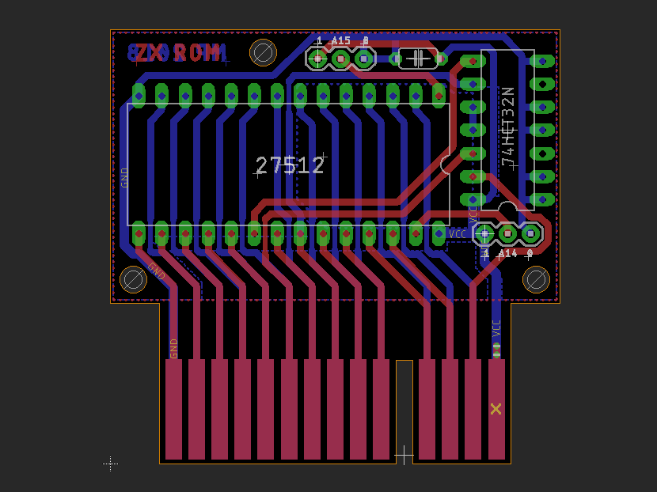

# ZXS_I2_kartridz

Simple ROM cartridge for [Sinclair ZX Interface 2](https://en.wikipedia.org/wiki/ZX_Interface_2).

**This is basically updated Droy's [ZX Cart](http://trastero.speccy.org/cosas/droy/cartuchos/cartuchos_s.htm)**. My version contains an EEPROM chip W27C512 instead of the 27\*128 or 27\*256. The main reason is that the W27C512 is more common and cheaper than 27\*128 and 27\*256 nowadays. Search for W27C512 on the eBay... Also, W27C512 has a bigger capacity. The number 512 in the chip name means 512 Kib (= 64 KiB). So one cartridge can hold up to four 16 KiB ROM banks. Of course, only one ROM file can be active at one time. 

## Notes 

For uploading ROM file is needed a HW programmer. For example, relatively cheap universal programmer *MiniPro TL866CS* from eBay is sufficient.  

Jumpers A14 and A15 decide which 16 KiB ROM bank is active. 

This is only simple ROM cartridge for 16 KiB ROMs. If you want better cartridge, check for example the sophisticated [Paul Farrow's ZXC4 cartridge](http://www.fruitcake.plus.com/Sinclair/Interface2/Cartridges/Interface2_RC_ZXC4.htm)

## EAGLE project

Project contains schematic and board.

Project was created with freeware version of Autodesk EAGLE.

## ROMs

See nice [overview by Paul Farrow](http://www.fruitcake.plus.com/Sinclair/Interface2/Cartridges/Interface2_RC_Cartridges.htm)

### Officialy released games (1984)

Originaly was released only 10 games. Namely:

- Backgammon
- Cookie
- Chess
- Horace and the Spiders
- Hungry Horace
- Jetpac
- Planetoids
- PSSST
- Space Raiders
- Tranz Am

You can download all ROM files of these games as [archive carts.zip](http://trastero.speccy.org/cosas/droy/cartuchos/carts.zip)

### Unreleased prototypes (cancelled)

- Popeye
- Q*Bert
- Gyruss
- Star Wars - The Arcade Game
- Return of the Jedi - Death Star Battle
- Loco Motion
- Montezuma's Revenge

### Sinclair BASIC for ZX Spectrum (1982) 

### Alternative BASIC interpreters

- [OpenSE BASIC 3](https://sourceforge.net/projects/sebasic/)
- Gosh Woderful BASIC by Geoff Wearmouth ([mirror](https://8bit.yarek.pl/upgrade/zx.roms/gw03.zip))
- [Busy Soft ROM](https://busy.speccy.cz/tvorba/zxromky.htm)
- [prettybasic](https://github.com/reclaimed/prettybasic)
- ...

### Diagnostics 

Very useful ROMs for testing hardware of the ZX Spectrum.

- [Retroleum Diag ROM](http://blog.retroleum.co.uk/smart.zip) 
- [ZX-Diagnostics ROM by Brendan Alford](https://github.com/brendanalford/zx-diagnostics/releases)

### Experimental games

- DeathStar (8 KiB) (See [on fruitcake.plus.com](http://www.fruitcake.plus.com/Sinclair/Interface2/Cartridges/Interface2_RC_New_3rdParty_DeathStar.htm))

